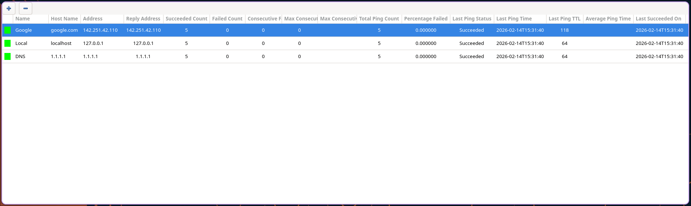

# ping-viewer

ICMP echo ping viewer inspired by [PingInfoView](https://www.nirsoft.net/utils/multiple_ping_tool.html), 
built to be customizable and support Linux.



## Installation

Dependencies:
- GTK4
- glib
- gcc

Download the source repo and build using meson/ninja.

```bash
git clone https://github.com/jchilds0/ping-viewer
cd ping-viewer
meson setup build
cd build
ninja
./ping-viewer
```

## Configuration

Configs are stored in `$XDG_CONFIG_HOME/ping-viewer/`. 
- `ping-viewer.conf`: List of hosts to add on startup (format: Host <Name> <Hostname/IP Address>).
- `style.css`: CSS styling.
